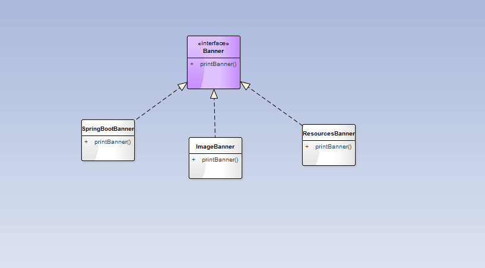
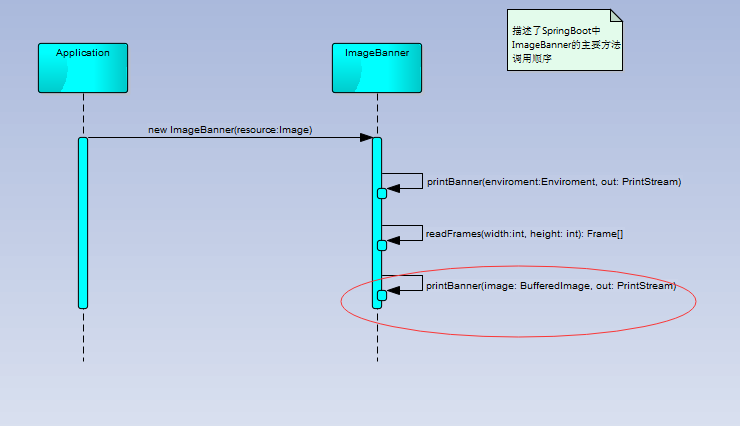

# 将每天做的工作记录于此
先说感想，说实话拿到demand后，首先想到的是在SpringBoot中有Banner功能的，所以查看了SpringBoot源码（如下图所示），发现确实是这个关系,就参考了ImageBanner的做法

## 2018-04-24
1. 将代码传到git上，做管理，方便维护
2. 还是测试先行，引入log4j，junit

## 2018-04-26
1. 看了SpringBoot中ImageBanner的实现，Spring中使用了ImageReader，获取到了每个Image Frame，再将每个Frame进行resize和然后转为banner打印
Spring实现比直接使用BufferImage直接读取图片效率要高
2. 实现有些复杂，看看是否可以简化一下，很多参数对于完成这个测试题，可以不去考虑

## 2018-04-27
1. 我将它简化，直接使用ImageIO读取出BufferImage，然后直接调用SpringBoot中的printBanner,（如图所示）标红的方法为简化入口点
2. 可以输出为文件了，补上两张UML图说明一下就可以了

3. 发现输出的图像有点变形，明天再接着调试一下吧

## 2018-04-28
1. 生成的txt文件与图片名称一致
2. 增加了bin文件夹，可以直接运行java -jar imageToBanner-1.0-SNAPSHOT.jar rat-clipart-2-150x150.jpg，生成文件

总结一下，这个方法还有问题，打印出来的图像有点变形。比如：命令行的参数，输出时背景色翻转，支持多种字符输出都没有实现。还有针对图像处理的getDistance、getLuminance这个方法没有看明白。

